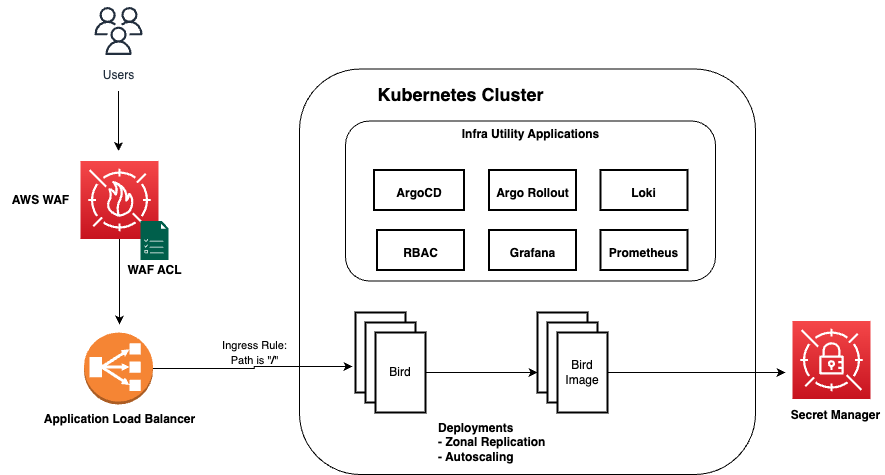
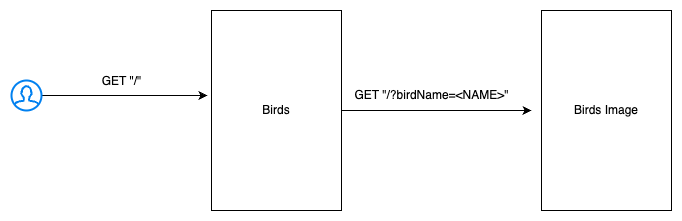
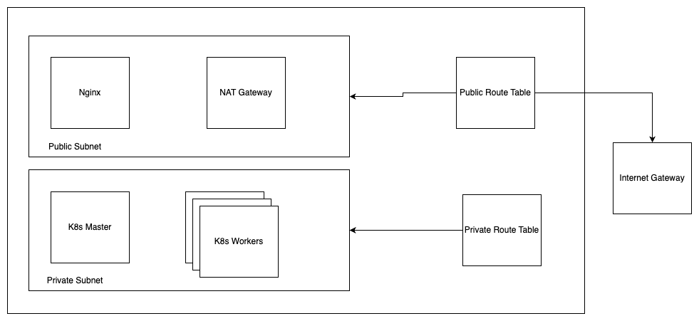

# Kubeadm Demo

## Introduction
This repository contains a demo representing architecture for a scalable and secure application deployment in self-managed kubernetes cluster with proper GitOps practices in-place.

## Architecture

High Level Architecture Diagram (proposed production architecture)

<p align="center"></p>

**NOTE**: a few components of this architecture is not implemented as part of this demo. The architecture represents proposed production ready setup

## Local Setup & Testing

### Applications
<p align="center"></p>

### Prerequisite
- Tools: [Go](https://go.dev/), and [Visual Studio Code](https://code.visualstudio.com/)
- Configure environment variables for [bird](./app/bird/) application - refer to [environment variables](./app/bird/README.md)
- Configure environment variables for [bird-image](./app/bird-image/) application - refer to [environment variables](./app/bird-image/README.md)

### Run application

```bash
$ cd ./app/bird
$ go run cmd/bird/main.go

$ cd ../bird-image
$ go run cmd/bird-image/main.go
```
 
### Test

```bash
$ curl localhost:8000
```

Response:
```json
{
  "data": {
    "name": "Bald Eagle",
    "description": "Bald eagles are large raptors known for their distinctive white head and tail feathers and powerful hunting abilities.",
    "image": "https://images.unsplash.com/photo-1611689342806-0863700ce1e4?crop=entropy&cs=tinysrgb&fit=max&fm=jpg&ixid=M3w2Mzg4NzZ8MHwxfHNlYXJjaHwxfHxCYWxkJTIwRWFnbGV8ZW58MHx8fHwxNzI2NTc5Njk0fDA&ixlib=rb-4.0.3&q=80&w=200"
  },
  "success": true
}
```

### Understanding Codebase

The provided codebase for `birds` and `birds-image` follow this directory structure

```text
├── Dockerfile // dockerfile for the codebase
├── README.md
├── cmd
│   └── bird
│       └── main.go // startup file for the server
├── go.mod
├── go.sum
└── pkg
    ├── constants
    │   └── constants.go // contains all constants and default variables used in repo
    ├── dto
    │   └── bird.go // DTO used to store API responses
    ├── http
    │   ├── httpclient
    │   │   └── httpclient.go // utility to perform API Calls
    │   └── server
    │       └── server.go // utility to setup server and routes
    ├── logger
    │   └── logger.go // common lib used for logging
    ├── service
    │   └── serviceHandler.go // service - contains all business logic
    └── utils
        └── utils.go // common utility functions
```


## Infra Setup
This directory contains terraform configuration files for provisioning a set of EC2 instances and other relevant resources which can be configured with the ansible scripts of the current repository to setup a Kubernetes cluster via Kubeadm

- [terraform](./infra/terraform/) consists terraform code to provision infra (VPC, SG, EC2, IAM configs, etc) in AWS
- [ansible](./infra/ansible/) consists ansible script to configure EC2 instances to setup required kubernetes cluster

### Architecture
<p align="center"></p>

### Prerequisite
- [AWS Account](https://aws.amazon.com/resources/create-account/)
- Access/Secret keys are generated and configured (Ref: [link](https://docs.aws.amazon.com/IAM/latest/UserGuide/id_credentials_access-keys.html))
- Required CLI Tools: [Terraform](https://learn.hashicorp.com/tutorials/terraform/install-cli), [Ansible](https://docs.ansible.com/ansible/latest/installation_guide/intro_installation.html)
- S3 Bucket to store terraform state files

### Provision Infrastructure

- Provide relevant values in [terraform.tfvars](./infra/terraform/terraform.tfvars) file
- Run terraform

```bash
$ cd terraform
$ terraform init \ 
     -backend-config "bucket=$TF_VAR_tf_state_bucket" \ 
     -backend-config "region=$TF_VAR_region" \ 
     -backend-config "key=$TF_VAR_application/$TF_VAR_environment"

$ terraform plan
$ terraform apply
```

- As a output, it should create a file at `./ansible/inventory` with list of all machines being created

### Configure Infrastructure

- Disable host key checking (optional): 
```bash
$ export ANSIBLE_HOST_KEY_CHECKING=False
```

- Run ansible

```bash
$ cd ansible
$ ansible-playbook --private-key <KEY_PEM_FILE> -i inventory kubernetes_cluster.yml
```

## Deploy Applications
### Prerequisite - Deploy required operators/services in cluster
#### External Secrets
Used to fetch secrets from External Secret Managers like AWS, GCP, Vault, etc. In our case, we are using it to fetch secrets (db credentials) from AWS Secret Manager

[Refer: Setup External Secrets](https://github.com/external-secrets/external-secrets)

**NOTE** make sure to install it in `external-secrets` namespace and use `kubernetes-external-secrets` as service account (as these details were provided by default in terraform while creating IAM role)

#### ArgoCD
Argo CD is a declarative, GitOps continuous delivery tool for Kubernetes. We would be using it to manage CD for Backend deployments.
[Refer: Install ArgoCD](https://argo-cd.readthedocs.io/en/stable/getting_started/)
**NOTE**: The default username of the ArgoCD UI would be `admin` and password can be obtained via below-mentioned command:

```bash
kubectl get secret argocd-initial-admin-secret -o jsonpath="{.data.password}" | base64 -d
```

#### Grafana Stack via Argo

For Logging and Monitoring - deploy Loki, Prometheus, Promtail, and Grafana
- [Argo App](./k8s/releases/argo/monitoring.yaml)
- [Helm Chart](./k8s/helm/kube-prometheus-stack/)
- [Values file](./k8s/releases/values/monitoring-values.yaml)

### Deploy Applications
1. Add secret for `UNSPLASH_API_KEY` in secret manager
2. Update values files: [bird](./k8s/releases/values/bird-values.yaml) and [bird-image](./k8s/releases/values/bird-images-values.yaml)
3. Apply argo [files](./k8s/helm/application/)
4. Sync application via Argo

Once deployed, access application on `http://<nginx-node-ip>:80`


### Future Improvements
- Add unit test cases
- Improve routes to follow REST conventions - possibly use some routes like `/api/v1/bird/random` and `/api/v1/bird/<birdName>` 
- Support for better error handling (via gin recovery)
- Possibility to merge both `birds` and `birds-image` codebases as most of the components are shared between them
- Support for autoscaling groups in terraform
- Improve cluster configuration flow (ansible scripts)
- Export custom metrics from code - can be used to track application performance
